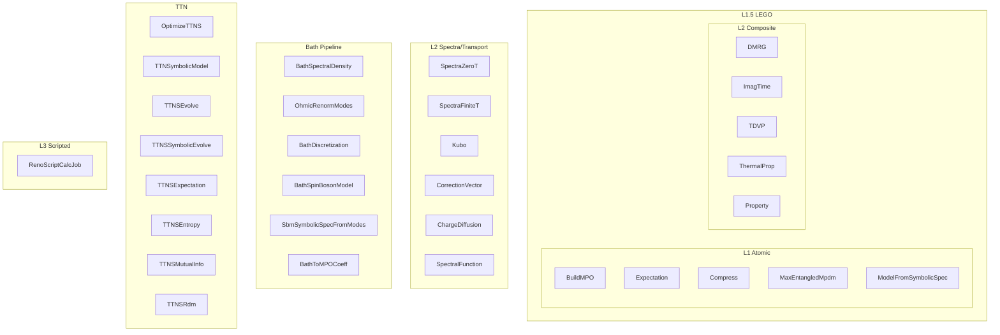
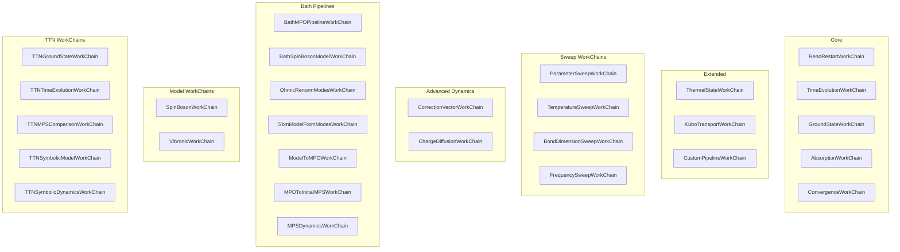

# aiida-renormalizer

AiiDA plugin for Renormalizer tensor-network workflows.

## What This Plugin Does

- Data nodes for models, operators, MPO/MPS/TTNO/TTNS
- CalcJobs for DMRG, TDVP, spectra, transport, TTN operations
- WorkChains for multi-step workflows

User interfaces: AiiDA Python API, `verdi run ...`

## Storage Model

Wavefunction payloads (MPS/TTNS) stored externally. AiiDA tracks provenance and metadata.

## Installation

### Runtime

```bash
pip install git+https://github.com/ansatzX/aiida-renormalizer
```

### Development

```bash
git clone https://github.com/ansatzX/aiida-renormalizer.git
cd aiida-renormalizer
pip install -e ".[dev]"
```

## AiiDA Setup

For production usage, use PostgreSQL plus RabbitMQ.

### Conda example (Linux)

```bash
conda create -n aiida -c conda-forge python=3.12 aiida-core=2.7.3 aiida-core.services postgresql "numpy<2.0"
conda activate aiida

# Initialize and start PostgreSQL inside the conda environment
mkdir -p "$CONDA_PREFIX/var/postgresql"
initdb -D "$CONDA_PREFIX/var/postgresql"
pg_ctl -D "$CONDA_PREFIX/var/postgresql" -l "$CONDA_PREFIX/var/postgresql/logfile" start

# Start services
verdi presto
```

Notes:

- On Linux, `aiida-core.services` can manage PostgreSQL and RabbitMQ.

### Conda example (macOS)

```bash
conda create -n aiida -c conda-forge python=3.12 aiida-core=2.7.3 postgresql rabbitmq-server "numpy<2.0"
conda activate aiida

# Initialize and start PostgreSQL inside the conda environment
mkdir -p "$CONDA_PREFIX/var/postgresql"
initdb -D "$CONDA_PREFIX/var/postgresql"
pg_ctl -D "$CONDA_PREFIX/var/postgresql" -l "$CONDA_PREFIX/var/postgresql/logfile" start

# Start RabbitMQ broker
rabbitmq-server -detached
rabbitmqctl await_startup
```

Notes:

- On macOS, do not rely on `aiida-core.services` due to dependency/platform issues.
- `rabbitmq-server` is the RabbitMQ broker daemon required by AiiDA daemon/task transport.
- If `rabbitmq-server -detached` fails with an address/port error, check:
  `rabbitmq-diagnostics -q ping`

### Create database and profile

```bash
createuser -s aiida
createdb -O aiida aiida
verdi quicksetup \
  --profile default \
  --email "you@example.com" \
  --first-name "Your" \
  --last-name "Name" \
  --institution "Your Org" \
  --db-engine postgresql_psycopg \
  --db-backend core.psql_dos \
  --db-username aiida \
  --db-name aiida \
  --db-hostname localhost \
  --db-port 5432 \
  --non-interactive
verdi daemon start
```

## Examples

22 example scripts organized into `calcjob/` (low-level) and `workchain/` (high-level) with mirrored MPS/TTN cases.

TTN example:
```bash
verdi run examples/workchain/ttn/sbm_zt/run_one_shot.py
```

MPS example:
```bash
verdi run examples/workchain/mps/sbm/run_one_shot.py
```

## Publication Bundles

Wavefunction artifacts are stored externally. Publication bundles can be created with provenance metadata and artifact manifests for sharing/archiving.

CLI export command (`verdi reno bundle ...`) is temporarily disabled during API refactor.

## Current Scope

- Data types: ModelData, MPSData, MPOData, OpData, BasisSetData, ConfigData, BasisTreeData, TensorNetworkLayoutData, TTNSData, TTNOData
- Parsers: RenoBaseParser, ScriptedParser
- Examples: 22 scripts in `calcjob/` and `workchain/`

### CalcJobs (33 total)



### WorkChains (28 total)



## Tests

Run the plugin suite from the package directory:

```bash
cd aiida-renormalizer
uv run python -m pytest -q tests
```

## Requirements

- Python >= 3.9
- `aiida-core==2.7.3`
- `renormalizer`
- `numpy<2.0`

## Compatibility Notes

- The plugin drivers target current Renormalizer public APIs (`renormalizer.utils.configs`), not legacy `renormalizer.parameter`.
- For AiiDA 2.7.3 environments, use `verdi run ...` for script-style launches.
- The custom `verdi reno ...` CLI entrypoint is temporarily disabled during API refactor.
- Some advanced Renormalizer branches are upstream-limited and may raise `NotImplementedError` depending on model/configuration (for example complex Kubo coupling paths).

## License

Not Setup now
